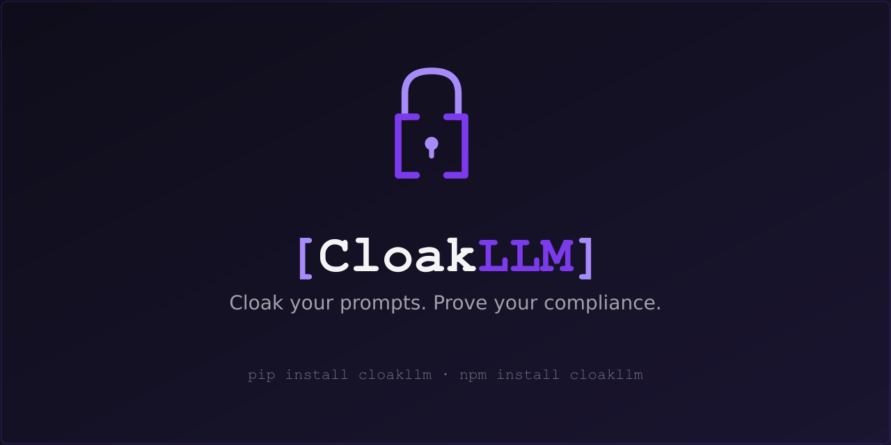
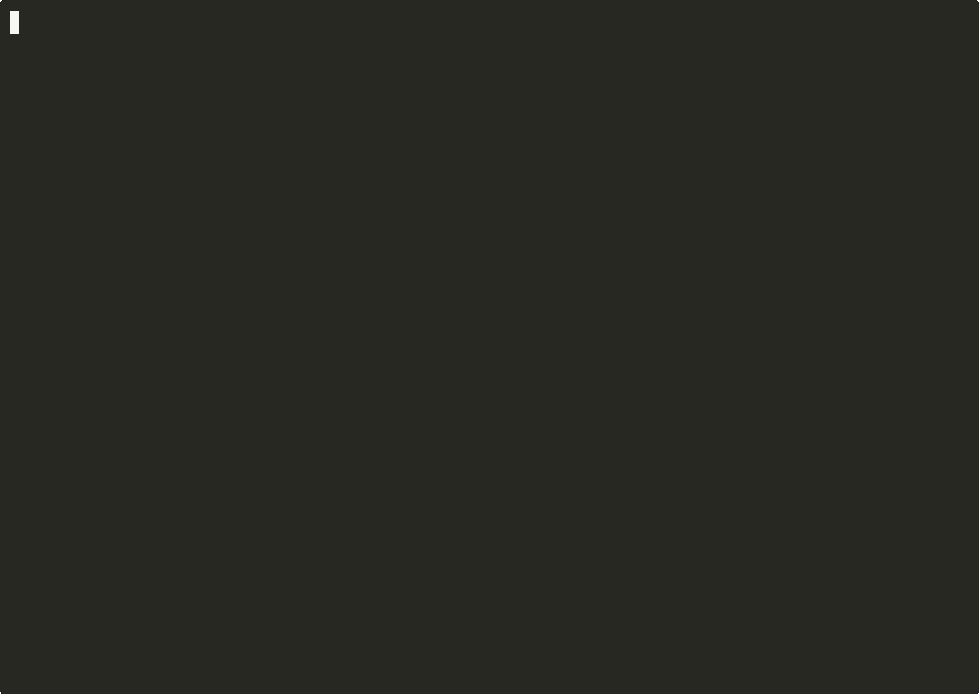

<p align="center">
  
</p>

<p align="center">
  <a href="LICENSE"></a>
  <a href="https://openinventionnetwork.com/" target="_blank" rel="noopener"></a>
  <a href="https://pypi.org/project/cloakllm/"></a>
  <a href="https://pypi.org/project/cloakllm-mcp/"></a>
  <a href="https://www.npmjs.com/package/cloakllm"></a>
</p>

# CloakLLM

**Cloak your prompts. Prove your compliance.**

Open-source PII protection middleware for LLMs. Detect sensitive data, replace it with reversible tokens, and maintain tamper-evident audit logs — all before your prompts leave your infrastructure.

<p align="center">
  <a href="https://asciinema.org/a/odNEs0kWP51YRGtl" target="_blank">
    
  </a>
  <br>
  <sub>▶ <a href="https://asciinema.org/a/odNEs0kWP51YRGtl">Watch interactive demo on asciinema</a></sub>
</p>

## SDKs

| SDK | Version | Install | Docs |
|-----|---------|---------|------|
| [CloakLLM-PY](https://github.com/cloakllm/CloakLLM-PY) | 0.12.0 | `pip install cloakllm` | [Python README](https://github.com/cloakllm/CloakLLM-PY#readme) |
| [CloakLLM-JS](https://github.com/cloakllm/CloakLLM-JS) | 0.12.0 | `npm install cloakllm` | [JS/TS README](https://github.com/cloakllm/CloakLLM-JS#readme) |
| [CloakLLM-MCP](https://github.com/cloakllm/cloakllm-mcp) | 0.12.0 | `python -m mcp run server.py` | [MCP README](https://github.com/cloakllm/cloakllm-mcp#readme) |
| [cloakllm-verifier](https://github.com/cloakllm/cloakllm-verifier) | 0.12.0 | `pip install cloakllm-verifier` / `npm install cloakllm-verifier` | [Verifier README](https://github.com/cloakllm/cloakllm-verifier#readme) |

## What it does

- **PII Detection** — emails, SSNs, credit cards, phone numbers, API keys, and more
- **LLM-Powered Detection** — opt-in local Ollama integration catches context-dependent PII that regex misses (addresses, medical terms)
- **Reversible Tokenization** — deterministic `[CATEGORY_N]` tokens that preserve context for the LLM
- **Redaction Mode** — irreversible `[CATEGORY_REDACTED]` replacement for GDPR right-to-erasure
- **Tamper-Evident Audit Logs** — hash-chained entries for EU AI Act Article 12 compliance
- **Custom LLM Categories** — user-defined semantic PII types (PATIENT_ID, EMPLOYEE_NUMBER) via configurable Ollama detection
- **Per-Entity Hashing** — deterministic HMAC-SHA256 hashes per detected entity for cross-request correlation without storing PII
- **Performance Metrics** — per-pass timing breakdowns (regex, NER, LLM) in audit logs and via `shield.metrics()` API
- **Incremental Streaming** — `StreamDesanitizer` state machine replaces tokens as chunks arrive, no full buffering
- **Cryptographic Attestation** — Ed25519-signed sanitization certificates with Merkle tree batch proofs and replay-resistant nonces
- **Multi-Language PII Detection** — 13 locales (DE, FR, ES, IT, PT, NL, PL, SE, NO, DK, FI, GB, AU) with locale-specific patterns
- **Context Risk Analysis** — `ContextAnalyzer` scores re-identification risk in sanitized text (token density, identifying descriptors, relationship edges)
- **Normalized Token Standard** — formal spec ([TOKEN_SPEC.md](TOKEN_SPEC.md)) with validation utilities (`validateToken`, `parseToken`), canonical regex, and built-in category registry
- **Pluggable Detection Backends** — `DetectorBackend` base class for custom detection pipelines; swap or extend the default regex→NER→LLM pipeline with your own backends
- **Article 12 Compliance Mode** — formal EU AI Act compliance profile (`compliance_mode="eu_ai_act_article12"`) adds tamper-detectable compliance fields to every audit entry, plus `compliance_summary()` and structured `verify_audit(output_format="compliance_report")` for auditors. See [COMPLIANCE.md](COMPLIANCE.md).
- **Article 4a Bias Detection Workflow** *(v0.7.0+)* — `BiasDetectionSession` context-managed API for processing GDPR Article 9 special-category PII (race, ethnicity, religion, political opinion, health/biometric, sexual orientation, trade union, genetic) strictly for AI bias detection and correction. Enforces all six Article 4a safeguards: recorded justification, pseudonymisation, in-memory-only token map, `categories_allowed` scope cap, hard-bounded `max_lifetime_seconds` with auto-wipe on exit, and full audit-chain recording. Builds on Article 12. See [COMPLIANCE.md § Article 4a](COMPLIANCE.md).
- **Article 50 Content-Labeling Record-Keeping** *(v0.10.0+)* — `Shield.record_content_generation()` writes a `content_generation` audit event proving synthetic content was AI-generated and whether a machine-readable label / deep-fake disclosure was applied — for the EU AI Act Article 50 transparency obligation (applies 2 December 2026). `generate_compliance_report()` gains an Article 50 rollup (label-coverage %, modality breakdown, deep-fake count) so **one report proves Article 12 + 4a + 19 + 50 together**. The content itself never reaches CloakLLM — only a caller-computed hash. Record-keeping lane only; CloakLLM does not embed watermarks (C2PA / SynthID territory). `cloakllm content-log` CLI + `record_content_generation` MCP tool. See [COMPLIANCE.md § Article 50](COMPLIANCE.md).
- **Trusted Timestamping (RFC 3161)** *(v0.11.0+)* — `Shield.checkpoint()` stamps the audit chain's latest hash at an RFC 3161 Time-Stamp Authority, proving *"every entry up to here existed no later than time T"* under an external clock the deployer can't control — the defense against a backdated history. An **eIDAS-qualified TSA** gives the timestamp legal presumption of accuracy in EU audits. Checkpoint-level (one stamp covers everything before it by hash-chain induction), opt-in, fully **offline-verifiable**, and the TSA only ever sees a hash. `cloakllm timestamp now`/`verify` CLI + `record_chain_checkpoint` MCP tool. Optional `[timestamping]` extra (Python); zero-dep (JS). See [COMPLIANCE.md § Trusted Timestamping](COMPLIANCE.md).
- **Enterprise Key Management** *(experimental — disabled in v0.6.1)* — KMS/HSM provider scaffolding (AWS KMS, GCP KMS, Azure Key Vault, HashiCorp Vault) is in place but currently raises `NotImplementedError`. Use `LocalKeyProvider` until v0.7.0.
- **Security Hardened** — Ollama SSRF prevention, thread-safe operations, ReDoS protection, CLI PII redaction by default
- **Detection Benchmark** — 108-sample labeled PII corpus with recall/precision/F1 harness, CI-enforced thresholds
- **Middleware Integration** — drop-in support for LiteLLM and OpenAI SDK (Python) and OpenAI/Vercel AI SDK (JS)
- **MCP Server** — use CloakLLM directly from Claude Desktop, Cursor, or any MCP-compatible client

## Quick Start

### Python

```bash
pip install cloakllm
```

```python
# Option A: OpenAI SDK
from cloakllm import enable_openai
from openai import OpenAI

client = OpenAI()
enable_openai(client)  # Wraps OpenAI SDK — all calls are now protected

# Option B: LiteLLM
import cloakllm
cloakllm.enable()  # Wraps LiteLLM — all calls are now protected
```

### JavaScript / TypeScript

```bash
npm install cloakllm
```

```javascript
const cloakllm = require('cloakllm');

cloakllm.enable(openaiClient);  // Wraps OpenAI SDK
```

### MCP (Claude Desktop)

> **Note:** MCP tools are called *by the LLM* after it receives your prompt. The MCP server cannot prevent PII in your initial prompt from reaching the provider. For prompt-level protection, use the SDK middleware above.

Add to your `claude_desktop_config.json`:

```json
{
  "mcpServers": {
    "cloakllm": {
      "command": "python",
      "args": ["-m", "mcp", "run", "server.py"],
      "cwd": "/path/to/cloakllm-mcp"
    }
  }
}
```

This exposes **fourteen tools** to Claude: **sanitize**, **sanitize_batch**, **desanitize**, **desanitize_batch**, **analyze**, **analyze_batch**, **analyze_context_risk** (added v0.5.0), **bias_detection_session_start** / **bias_pseudonymise** / **bias_detection_session_end** (added v0.7.0 for the EU AI Act Article 4a workflow), **generate_compliance_report** (added v0.8.0 -- end-to-end EU AI Act compliance reports in JSON / Markdown), **get_key_manifest** (added v0.8.1 -- externally-verifiable key provenance), and **record_content_generation** (added v0.10.0 -- Article 50 content-labeling record-keeping), and **record_chain_checkpoint** (added v0.11.0 -- RFC 3161 trusted timestamping).

## Roadmap

Shipped in v0.8.1: **externally-verifiable KeyManifest** (`KeyManifest` + `verify_key_provenance()` + `cloakllm key-manifest verify` CLI + `get_key_manifest` MCP tool). Closes the trust loop on v0.8.0 reports: an EU AI Office auditor can now verify CloakLLM audit-chain signatures **without trusting CloakLLM, your deployer, or anyone else's word about which keys are real**. The audit chain stands on its own. Upcoming: KMS provider rebuild -- AWS / GCP / Azure / Vault. Full EU AI Act suite (sandbox-ready config, partner integrations, SME tier) in v1.0.

## License

MIT
